# 🐟 Frontend - StockFish - Gestion de Stock pour l'Industrie des Conserves de Poisson

## 🚀 Introduction

**Frontend - StockFish** est un projet développé avec **Angular** pour créer une application web de gestion de stock, spécifiquement conçue pour les entreprises spécialisées dans la production de conserves de poisson. Cette application permet une gestion optimisée et détaillée des utilisateurs, des dépôts, des articles, des fournisseurs, et bien plus encore.

## 🛠️ Fonctionnalités Principales

### 👥 Gestion des Utilisateurs
L'application permet d'administrer les utilisateurs avec différents rôles et niveaux d'accès, garantissant une gestion sécurisée et hiérarchisée du stock.

  
  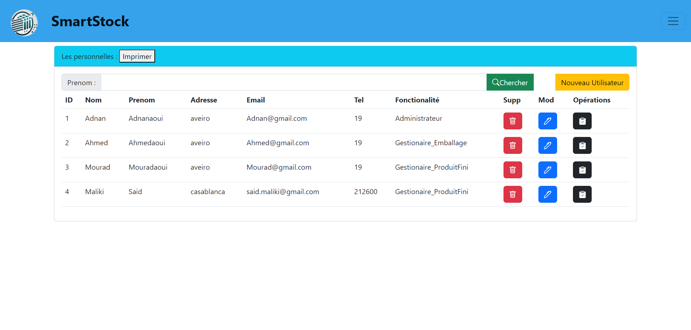

### 🏢 Gestion des Dépôts
La gestion des dépôts est au cœur de l'application. Elle offre une vue complète sur l'inventaire des différents dépôts, que ce soit pour les emballages ou les produits finis.

### 🛒 Gestion des Articles
L'application fournit des outils pour gérer les articles en détail, y compris :
- **Familles d'Articles** : Classer les articles par marque, ingrédient, qualité, et nature du poisson.
- **Stockage** : Attribuer des emplacements précis pour chaque article dans les dépôts.

### 🔗 Gestion des Fournisseurs
Maintenir un suivi rigoureux des fournisseurs et des transactions effectuées avec eux.

### 🗃️ Gestion des Familles d'Articles
Les familles d'articles sont classées selon plusieurs critères :
- **Marque**
- **Ingrédient**
- **Qualité**
- **Nature du poisson**

### La base technique 

  
  

### 📦 Gestion du Stock Optimisée
Une attention particulière est portée à l'optimisation du stockage. Lors de chaque opération d'entrée dans un dépôt, l'application permet de choisir le bloc de stockage optimal, basé sur une distribution spécifique des allées, des rangées, et des niveaux.

  
  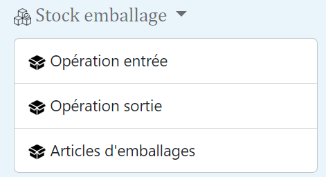
  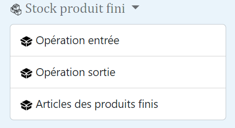

## 🗺️ Distribution des Allées, Rangées et Niveaux

L'application organise le stockage dans les dépôts en trois dimensions : les **allées**, les **rangées**, et les **niveaux**. Chaque combinaison de ces trois éléments désigne un emplacement précis pour un bloc de stockage.

  
  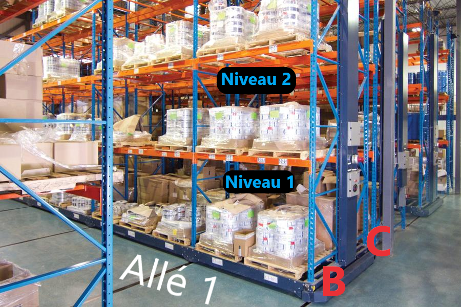

- **Allées** : Représentent les sections principales du dépôt (par exemple, Allée 1, Allée 2, etc.).
- **Rangées** : Désignent les colonnes ou les divisions horizontales à l'intérieur de chaque allée (par exemple, Rangée B, Rangée C, etc.).
- **Niveaux** : Indiquent la hauteur ou le niveau spécifique où un article est stocké (par exemple, Niveau 1, Niveau 2, etc.).

Cette classification permet une gestion extrêmement précise et optimisée du stock, assurant que chaque article est facilement localisable et accessible.

### 📊 Extraction des Clés d'Identification de Performance (KPI)

L'application **StockFish** inclut une fonctionnalité avancée d'**extraction des KPI** (Key Performance Indicators) pour surveiller et améliorer les performances de la gestion du stock. Ces indicateurs sont présentés sous forme de graphiques interactifs, offrant une visualisation claire et concise des données cruciales, telles que :

- **Nombre d'utilisateurs total** : Suivi du nombre total d'utilisateurs actifs sur la plateforme.
- **Nombre total d'articles** : Indicateur du nombre total d'articles gérés dans l'ensemble des dépôts.
- **Nombre de familles utilisées** : Compte les différentes familles d'articles (marque, ingrédient, qualité, nature de poisson) utilisées dans l'application.
- **Quantité actuelle dans les dépôts d'emballage et de produit fini** : Mesure la quantité de stock disponible dans les dépôts dédiés aux emballages et aux produits finis.
- **Nombre d'opérations E/S par dépôt quotidiennement** : Suivi du nombre d'entrées et sorties (E/S) réalisées quotidiennement dans chaque dépôt.
- **Quantité totale des articles E/S par dépôt quotidiennement** : Évalue la quantité totale des articles entrés et sortis dans chaque dépôt sur une base quotidienne.

Ces KPI sont essentiels pour permettre aux gestionnaires d'entrepôts et aux responsables logistiques de prendre des décisions éclairées, d'améliorer les processus, et de garantir une gestion optimale des stocks.

  
  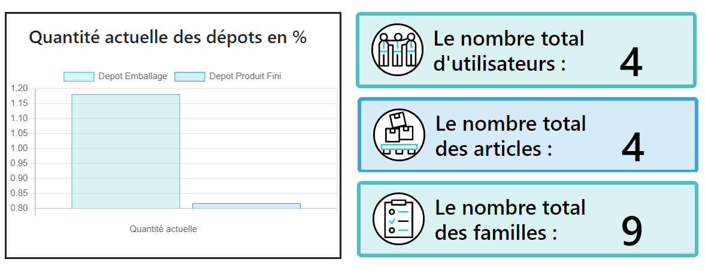

  
  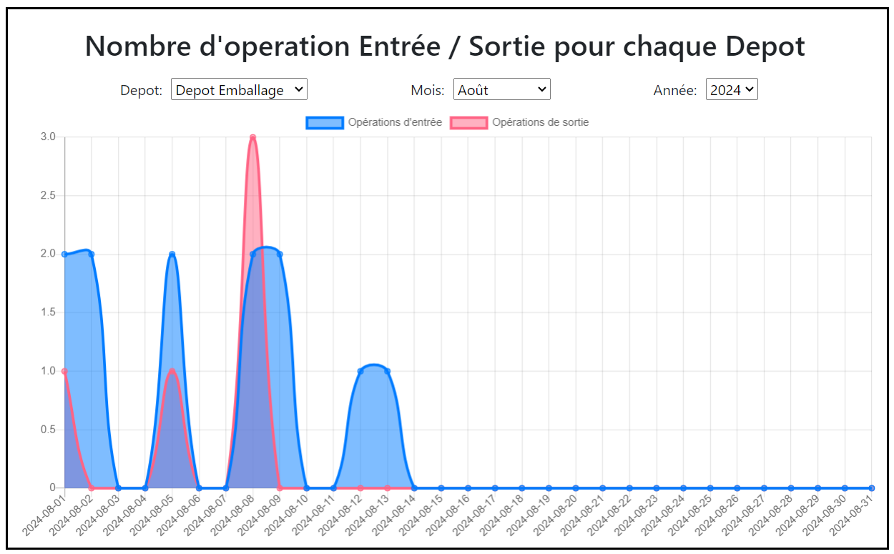

  
  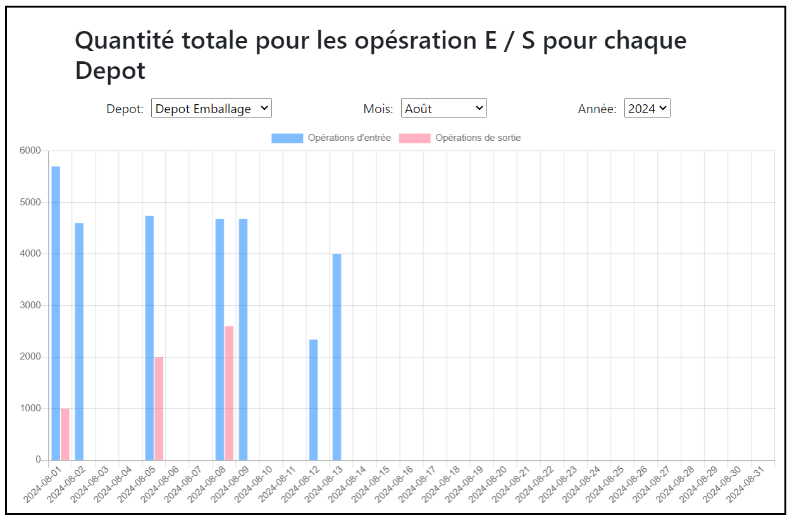

### 🖼️ Captures d'Écran des Interfaces de l'Application

Voici quelques captures d'écran illustrant les différentes interfaces de l'application **StockFish** :

#### 🖥️ Interface de Gestion des Ingrédient
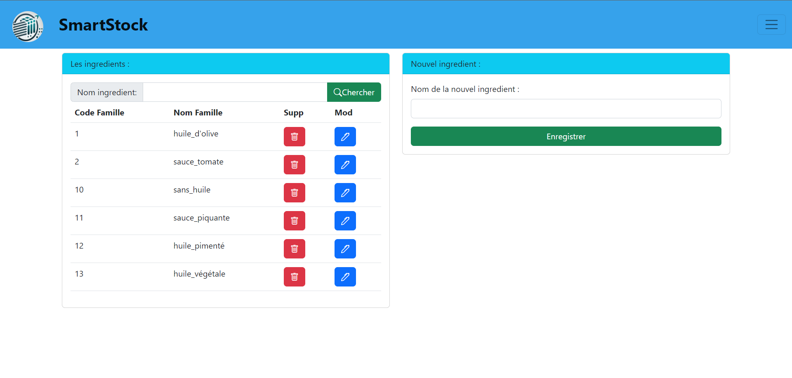

#### 📦 Interface de Gestion des Articles
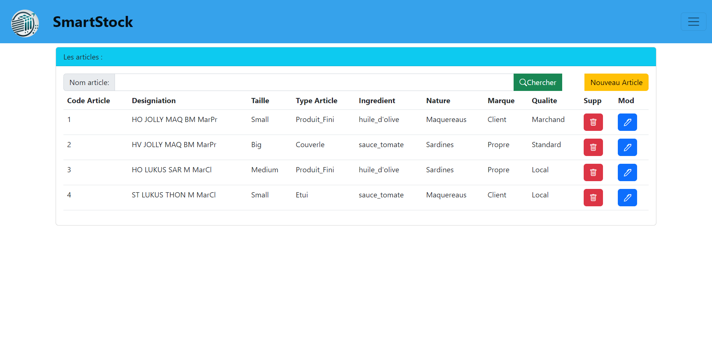

#### 🏢 Interface de Gestion des Opérations
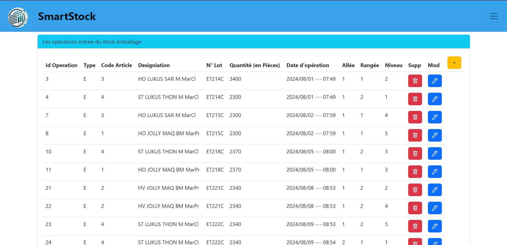

#### 📊 Interface d'une opération d'entrée
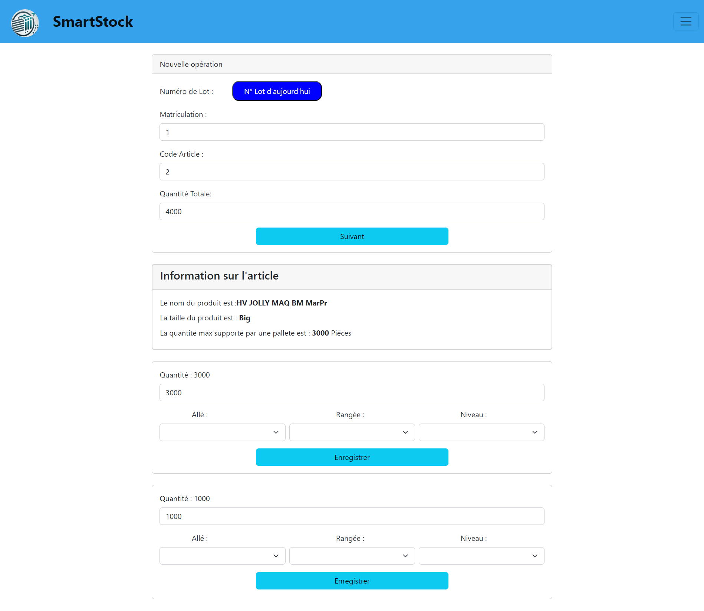

## 🔗 Lien vers la Partie Backend

👉 Pour une expérience complète, consulte également la partie **backend** de l'application : [Backend - StockFish](https://github.com/BiouiAdnane/Backend---StockFish).

## 📝 Licence

Ce projet est licencié sous la licence MIT - voir le fichier [LICENSE](LICENSE) pour plus de détails.

